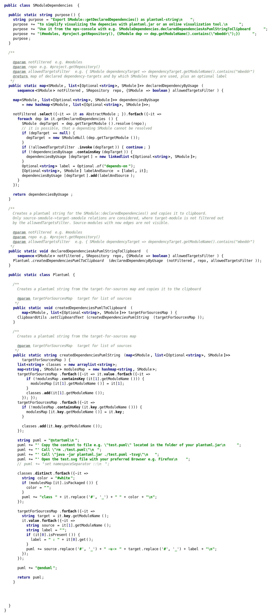
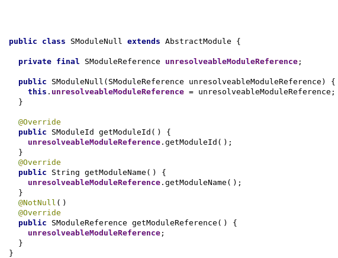
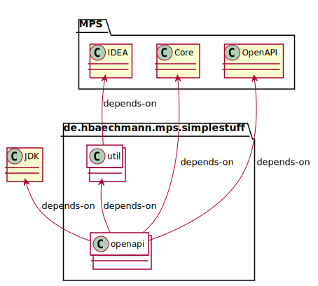

# mps-simple-stuff

Created with Jetbrains MPS 2019.3.7 and Plantuml.

Icons made by <a href="https://www.flaticon.com/authors/pixel-perfect" title="Pixel perfect">Pixel perfect</a> from <a href="https://www.flaticon.com/" title="Flaticon">www.flaticon.com</a>

e.g.

Can produce this

